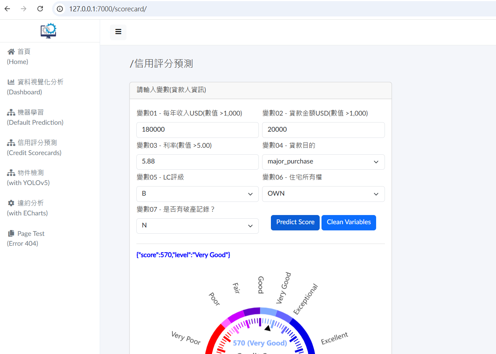

#### __Read this in other languages:__ [[Chinese(中文)]](README_CHT.md)<br><br>

# **tagui_demo_01**

## **RPA: Implementing an example of integrating JavaScript and Python with TagUI for Web Automation**

### **Ⅰ. Purpose** 
In recent exploration of Robotic Process Automation (RPA), I experienced several RPA tools including UiPath and Power Automate. Unlike commercial software, TagUI is an open-source RPA tool. The content of this project is a demo to implement an example of integrating JavaScript and Python with TagUI for Web Automation.<br><br>

### **Ⅱ. Tools**
TagUI、JavaScript、Python<br><br>

### **Ⅲ. Statement**

__1. The steps of the process__ <br>

The process can be roughly divided into three steps:<br>

__Step_01:__ Starting docker containers<br>
That is to run services including web site, API, Database, etc. (Please refer to [django_demo_01](<https://github.com/qinglian1105>))<br><br>
__Step_02:__ Operation on website <br>
Firstly, TagUI would open browser Chrome on URL, 127.0.0.1:7000/login/, and then key in account and password to log in. Secondly, selecting item, Credit Scorecards, of side menu, TagUI would complete the form and then submit it. After returning results (bule text and gauge panel) as shown below, TagUI would save them as variables.<br>


<br><br>

__Step_03:__ Processing data with JavaScript and Python<br>
TagUI would make JavaScript code to parse variables into JSON string. Then, running Python code would process them for displaying on terminal and save them into CSV file.<br> 

Concerning to the detail of the above steps, please refer to files: <br>
\./mode_headless/\*.tag <br> 
\./mode_visual_automation/\*.tag <br>
\./mode_\*/outputs/report.csv<br>
 
<br> 

__2. About files__ <br>

(1)__tag-files__ <br>

As you can see in this project, there are several folders. "mode_headless" and "mode_visual_automation" are mainly folders for running tag-files. Each of them has its own
sub-folders, tag-files, csv-file, and js-file. 
The tag-files in the folder "mode_headless" can be executed in headless mode by the command with parameter "-h" or "-headless". For example:

```bash
tagui file_name.tag -h
```

However, the tag-files in the folder "mode_visual_automation" are unable to do so, because execution mode is visual automation, using OCR (optical character recognition) to scan UI element on the screen with png files (Please refer to sub-folder, image).<br>
Fundamentally, the execution sequence of tag-files is: <br>
sub_main.tag →<br>
sub01_startContainer.tag →<br>
sub02_jsParse.tag →<br>
sub03_operateWebsite.tag →<br>
sub04_pythonProcessing.tag <br>

(2)__TagUI in python__ <br>

The folder "tagui_in_python" has one python-files and three sub-folders. By installing the package "rpa", it can directly use TagUI in Python code, different from the above tag-files only allowing other programming, like Python or JavaScript, to run in parts of tag-files. In addition, as we know that Python has a rich ecosystem of third-party modules and libraries that extend its functionality for various tasks. Therefore, if you are good at Python, you will find it very convenient to use TagUI. Please refer to the file "py_tagui.py".
<br><br> 

__3. Results__ <br>

As mentioned above, the programming of the process has two ways for different modes. The pictures as below display part of code in tag-file and result in the terminal. Besides, the results directly completed by Python are as follows.<br>

(1)headless mode<br>

By tag-files<br>
<br><br>

By Python<br>
<br><br>

(2)visual automation mode<br>

By tag-files<br>
<br><br>

By Python<br>
<br><br>

As you can see from pictures, different modes produce the the same result. Obviously, in the speed of execution, "headless" mode performs faster than "visual automation" mode.<br>

__The above offers an example of integrating JavaScript and Python with TagUI for Web Automation.<br> Besides, another example, all executed by using Python, is also provided.__ <br>

Similar examples with different tools (Please refer to [uipath_demo_01](<https://github.com/qinglian1105/uipath_demo_01>)  or  [power_automate_demo_01](<https://github.com/qinglian1105/power_automate_demo_01>)) 
<br><br>

---

### **Ⅳ. References**

[1] [Top 5 Five Open Source RPA Frameworks to Accelerate Automation](<https://www.simplilearn.com/top-open-source-rpa-frameworks-to-accelerate-automation-article>)

[2] [AI Singapore - TagUI](<https://aisingapore.org/aiproducts/tagui/>)

[3] [aisingapore/TagUI](<https://github.com/aisingapore/TagUI>)

[4] [Introduction to Opensource RPA TagUI](<https://www.youtube.com/watch?v=1JRuSZNBBUk&list=PL2gs9_mNDDvZSCPsJu4APZR6AaDzUY7R6>)

[5] [TagUI — TagUI 6.110.0 documentation](<https://tagui.readthedocs.io/en/latest/>)

[6] [RPA for Python: tebelorg/RPA-Python](<https://github.com/tebelorg/RPA-Python>)