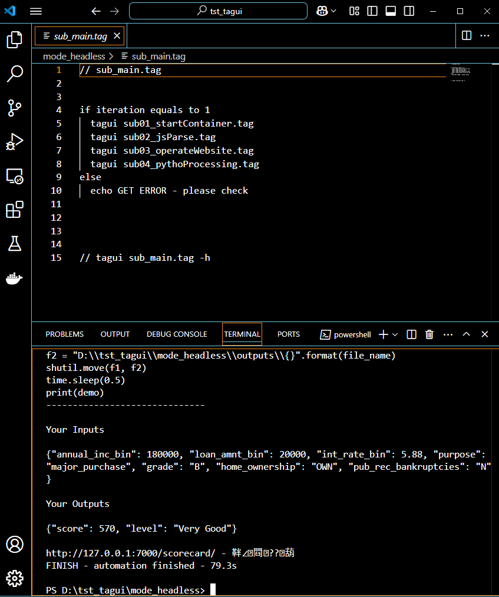
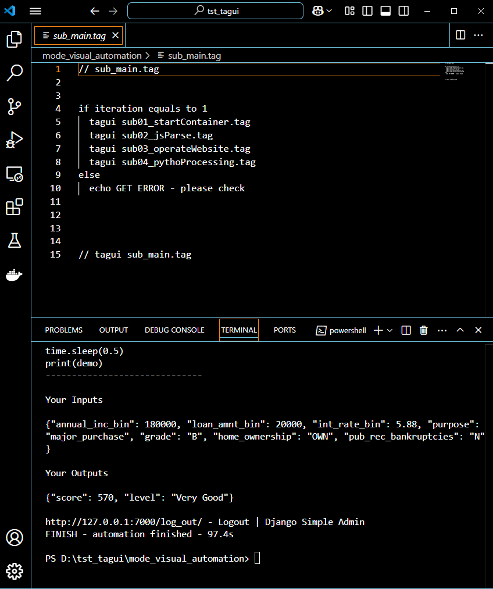

#### __其他語言版本：__ [[English]](README.md)<br><br>

# **tagui_demo_01**

## **RPA：一個Web Automation例子展現TagUI與JavaScript、Python整合**

### **Ⅰ. 目的** 
研調 機器人流程自動化 (Robotic Process Automation, RPA)，實作開源RPA軟體 - TagUI來操作「應用程式」及「網頁」，並在其流程中使用JavaScript及Python處理資料。 
<br><br>

### **Ⅱ. 主要工具**
TagUI、JavaScript、Python<br><br>

### **Ⅲ. 說明**<br>

__1.流程步驟__ <br>

流程可粗略地分為三步驟：<br>

__Step_01:__ Starting docker containers<br>
TagUI開啟應用程式「Docker Desktop」，然後啟動相關服務，如：前端網頁、後端API及資料庫…等( 詳見 [專案django_demo_01](<https://github.com/qinglian1105>) )。<br>

__Step_02:__ Operation on website <br>
TagUI開啟瀏覽器(Chrome)，到一個網站( 127.0.0.1:7000/login/ ，如上述專案 ) ，接著輸入帳密登入進入首頁後，於左側side menu點選「信用評分預測(Credit Scorecards)」選單，即進入目標頁面，填完Form的 7 個變數資料，點擊按鍵「Predict Score」後，將於下方以藍色文字及儀表盤呈現預測結果(分數、評級)，如下圖所示。 <br>

<br><br>
__Step_03:__ Processing data with JavaScript and Python<br>
由JavaScript程式擷取預測結果，Python程式將編輯內容及寫入CSV檔，然後返回予終端機(Terminal)顯示，完成整個Process自動化。<br>

以上關於細節內容詳見檔案： <br>
\./mode_headless/\*.tag <br> 
\./mode_visual_automation/\*.tag <br>
\./mode_\*/outputs/report.csv
<br>
<br>
__2. 關於tag檔案__ <br>

專案中有二個資料夾，分別為「mode_headless」及「mode_visual_automation」，分別有各自的子資料夾、tag檔、JavaScript檔及CSV檔。前者可以headless模式執行，於執行命令加上參數 -h 或 -headless，例：

```bash
tagui file_name.tag -h
```

然而，後者無法如此，因為它以visual automation模式執行，即使用 光學字元辨識(Optical Character Recognition, OCR)方式以事前準備好的圖片檔案(詳見其資料夾image的png檔)作螢幕掃描處理。<br>

基本上，tag檔的執行順序為：<br>
sub_main.tag →<br>
sub01_startContainer.tag →<br>
sub02_jsParse.tag →<br>
sub03_operateWebsite.tag →<br>
sub04_pythonProcessing.tag。
<br><br> 
__3. 執行結果畫面__ <br>

如同前述，流程的程式碼依照不同模式被寫成二種。下方圖片各自展示不同模式的tag檔的部份程式碼及執行結果顯示下方終端機視窗。<br>

(1)headless模式<br>

<br><br>

(2)visual automation模式<br>

<br><br>

如上二圖所示，不同模式，執行結果相同。執行時間當然headless模式較快。<br>

__以上，一個Web Automation例子展現TagUI與JavaScript、Python整合。__ <br>

(相似專案 [uipath_demo_01](<https://github.com/qinglian1105/uipath_demo_01>)  or  [power_automate_demo_01](<https://github.com/qinglian1105/power_automate_demo_01>) 請參考)
<br><br>

---

### **Ⅳ. 參考**

[1] [Top 5 Five Open Source RPA Frameworks to Accelerate Automation](<https://www.simplilearn.com/top-open-source-rpa-frameworks-to-accelerate-automation-article>)

[2] [AI Singapore - TagUI](<https://aisingapore.org/aiproducts/tagui/>)

[3] [aisingapore/TagUI](<https://github.com/aisingapore/TagUI>)

[4] [Introduction to Opensource RPA TagUI](<https://www.youtube.com/watch?v=1JRuSZNBBUk&list=PL2gs9_mNDDvZSCPsJu4APZR6AaDzUY7R6>)

[5] [TagUI — TagUI 6.110.0 documentation](<https://tagui.readthedocs.io/en/latest/>)
